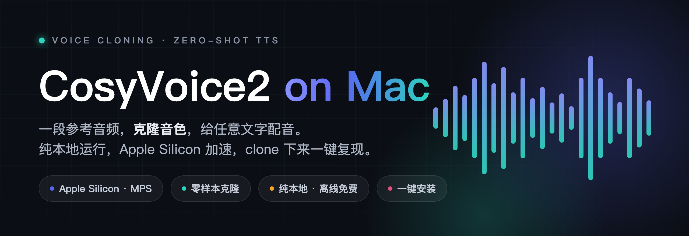

<p align="center">
  
</p>

# mac-cosyvoice2-quickstart

**English | [中文](README.md)**

> Zero-hassle deployment of **CosyVoice2-0.5B** on **macOS (Apple Silicon)** — clone a voice from a single reference clip and dub any text.

This is a minimal, battle-tested deployment recipe put together *after* hitting every pitfall. CosyVoice is officially built for Linux + NVIDIA GPU, so following the official steps on a Mac fails repeatedly. This project distills the flow — verified end-to-end on **Apple M4 Pro / 48G / macOS** — into one install script plus one CLI tool, so you can clone and reproduce it right away.

- ✅ Runs fully locally: free, offline, no dependency on CapCut or any cloud service
- ✅ Zero-shot cloning: feed a 3–10s reference clip and immediately dub any text in that voice — **no training required**
- ✅ Two cloning modes: with prompt text (zero-shot) / prompt-free (cross-lingual — skips whisper, avoids timbre drift from mis-transcription)
- ✅ Automatic reference-audio cleanup: denoise + loudness normalization + silence trimming + optional cleanest-clip extraction, directly boosting similarity
- ✅ Apple Silicon Metal (MPS) acceleration
- ✅ One-command install script that auto-bypasses every dependency pitfall on Mac

> ⚠️ This repo does **NOT** include the model weights or the CosyVoice official source (≈3.4G and tens of MB respectively) — they are pulled automatically by the install script. The repo contains only the deployment script, the wrapper tool, and this guide.

---

## 1. Requirements

| Item | Requirement |
|---|---|
| OS | macOS (Apple Silicon recommended: M1/M2/M3/M4 series) |
| RAM | ≥ 16G recommended (48G is very comfortable in testing) |
| Disk | Keep ≥ 8G free (model 3.4G + deps + cache) |
| Prerequisite | [Homebrew](https://brew.sh) installed |

> **No top-tier chip required.** Any Apple Silicon (even a base M1/M2) + 16G RAM will run it, and the output quality is identical. The only difference is synthesis speed: the stronger the chip and the more RAM, the faster. The developer tested on M4 Pro / 48G (a dozen characters synthesize in a few seconds); base models are slower but perfectly usable.
>
> Intel Macs can technically run it but will be very slow — not recommended.

---

## 2. One-Command Install

```bash
git clone https://github.com/BreetyGreen/cosyvoice2-mac.git
cd cosyvoice2-mac
bash install.sh
```

The script automatically:

1. Installs `ffmpeg` and `miniforge` (which provides conda)
2. Creates an isolated conda env `cosyvoice` (Python 3.10 + pynini) — **without polluting your system Python**
3. Clones the CosyVoice official source (including the Matcha-TTS submodule)
4. Generates a Mac-specific dependency list and installs it (CUDA index and other pitfalls already worked around)
5. Downloads the `CosyVoice2-0.5B` weights from the ModelScope mirror (≈3.4G, resumable)
6. Verifies that the key weight files are all present

> The script is **idempotent**: if the network drops or a step fails midway, just run `bash install.sh` again — completed parts are skipped and missing files are resumed automatically.

---

## 3. Generate Your First Dub

After installation:

```bash
# Enter the official repo directory (weights and source both live here)
cd CosyVoice

# Use your reference audio, auto-transcribe the prompt text, synthesize the target text
CONDA_BASE=$(conda info --base)
"$CONDA_BASE/envs/cosyvoice/bin/python" ../tts.py \
    --ref ~/Desktop/manbo.mp3 \
    --text "Hey everyone, save this one — like, share, and subscribe, see you next time!" \
    --out ../result.wav
```

Parameters:

| Parameter | Description |
|---|---|
| `--ref` | Reference audio (a clean voice clip of whoever you want to mimic; wav/mp3, no background music) |
| `--text` | The target text to synthesize |
| `--prompt-text` | (Optional) The exact sentence spoken in the reference clip. If omitted, whisper transcribes it automatically; providing it manually is faster |
| `--no-prompt-text` | (Optional) Prompt-free mode: uses cross-lingual inference, extracts the voice from audio only, skips whisper entirely |
| `--no-clean` | (Optional) Disable the reference-audio cleanup pipeline. On by default: denoise + loudness normalization + silence trimming |
| `--no-denoise` | (Optional) Skip FFT denoising during cleanup. Use when the voice is already clean and denoising makes it sound muffled |
| `--clip-seconds` | (Optional) Keep only the first N seconds after cleanup as the reference; 5–10s is best, 0 = no trimming |
| `--out` | Output wav path, defaults to `output.wav` |

### Faster: supply the prompt text manually to skip whisper

```bash
"$CONDA_BASE/envs/cosyvoice/bin/python" ../tts.py \
    --ref ref.wav \
    --prompt-text "the exact sentence spoken in the reference clip" \
    --text "the target text to synthesize" \
    --out ../result.wav
```

### Voice not similar enough? Try prompt-free mode (recommended)

Zero-shot mode needs the reference audio's transcript to align audio with text. If whisper mis-transcribes the reference (most common with mixed-language or noisy clips), the alignment drifts and **the cloned voice noticeably degrades**.

CosyVoice2 also offers a `cross-lingual` mode that **needs no prompt text at all** — it extracts the voice straight from the audio, immune to whisper errors. Just add `--no-prompt-text`:

```bash
"$CONDA_BASE/envs/cosyvoice/bin/python" ../tts.py \
    --ref ~/Desktop/manbo.mp3 \
    --text "the target text to synthesize" \
    --no-prompt-text \
    --out ../result.wav
```

> Trade-off: cross-lingual drops the biggest source of error (transcription), so the **timbre is more reliable**; the cost is that prosody/tone is occasionally less natural than zero-shot. Use zero-shot when the audio is clean and transcribable, otherwise prefer this.

### Still not similar? Clean up the reference audio first (the make-or-break step)

**About 70% of cloning similarity is decided by reference-audio quality** — the script and parameters account for only a small fraction of the rest. An ideal reference clip is: single speaker, no background music, clear articulation, one language only, 5–10 seconds, steady emotion. Real-world recordings rarely meet this, so this tool **cleans the reference audio automatically**:

```
high-pass filter (kill low-freq rumble) → FFT denoise (suppress background noise)
  → loudness normalization (stable volume) → trim leading/trailing silence & long pauses → resample to 16k
```

Cleanup is on by default, no flags needed. To purify further, add `--clip-seconds` to keep only the cleanest first few seconds:

```bash
"$CONDA_BASE/envs/cosyvoice/bin/python" ../tts.py \
    --ref ~/Desktop/manbo.mp3 \
    --text "the target text to synthesize" \
    --no-prompt-text \
    --clip-seconds 8 \
    --out ../result.wav
```

Handy switches:

- Voice already clean but sounds muffled after denoising → add `--no-denoise` (normalize + trim only)
- Want to compare against the raw audio → add `--no-clean` (disable cleanup entirely)
- Reference too long / emotionally uneven → use `--clip-seconds 8` to lock the steadiest segment

> One-line rule: **get/clean a solid reference clip first, then worry about scripts and parameters.** No mode can rescue dirty audio; clean audio sounds similar no matter how you run it.

### Prefer a web UI

CosyVoice ships an official WebUI (drag in audio, type text, click a button):

```bash
cd CosyVoice
"$CONDA_BASE/envs/cosyvoice/bin/python" webui.py --port 8000 \
    --model_dir pretrained_models/CosyVoice2-0.5B
# Open http://localhost:8000 in your browser
```

---

## 4. Pitfall Log (Why Mac Deployment Fails)

This section is the core value of the project. Every pitfall below is already handled by `install.sh`; they are listed here so you can understand the reasoning, or use them as reference when troubleshooting manually.

| # | Symptom | Root Cause | Fix |
|---|---|---|---|
| 1 | `pynini` fails to compile via pip | Requires compiling C++ OpenFst | Install via **conda** (conda-forge), not pip |
| 2 | `requirements.txt` slows down / errors | First line has `--extra-index-url ...cu121` (CUDA index) | No CUDA on Mac — remove that line → `requirements.mac.txt` |
| 3 | `openai-whisper` throws `No module named 'pkg_resources'` | Newer setuptools (≥81) removed pkg_resources | Install `setuptools<81` + `--no-build-isolation` |
| 4 | `pyworld` compile throws `No module named 'numpy'` | `--no-build-isolation` no longer auto-prepares build deps | Manually install `numpy==1.26.4` and `cython` first |
| 5 | `import gradio` / `import lightning` fails | Previous step only installed sub-packages, main packages missed | Install separately: `pip install gradio==5.4.0 lightning==2.2.4` |
| 6 | Inference reports missing `model.safetensors` / `speech_tokenizer_v2.onnx` | Model download interrupted by network, large files incomplete | Re-run the download — it resumes and fills the gaps |

**Version anchors** (a combination verified to work): Python 3.10.20 · pynini 2.1.5 · torch 2.3.1 (MPS available) · numpy 1.26.4 · gradio 5.4.0 · lightning 2.2.4.

---

## 5. FAQ

**Q: The first synthesis is slow?**
The first run loads three models (llm/flow/hift) plus the Qwen backbone into memory — about 1–2 minutes. After that, each clip takes a few to a dozen seconds.

**Q: How do I change the speed (like 1.2×)?**
CosyVoice produces 1× original-speed audio. Adjust the speed on the audio track in your editing software.

**Q: The cloned voice isn't similar enough?**
Use a cleaner, longer (~10s) reference clip without background music, and make sure `--prompt-text` matches the reference audio content.

---

## 6. ⚠️ Compliance & Legal Notice

Voice cloning is powerful, but "can do" does not equal "may do":

- ✅ Clone **your own voice** for a digital avatar
- ✅ Clone a voice actor's voice with **explicit authorization**
- ✅ Use the model's built-in default voices
- ⛔ Do **NOT** clone the voices of film/TV characters or specific celebrities for commercial use — this involves voice rights, likeness rights, and IP licensing, with high legal risk

Please use this project only in a lawful and compliant manner.

---

## 7. Acknowledgements

- [CosyVoice](https://github.com/FunAudioLLM/CosyVoice) by FunAudioLLM / Alibaba Tongyi Lab (Apache-2.0)
- Model weights from [ModelScope: iic/CosyVoice2-0.5B](https://www.modelscope.cn/models/iic/CosyVoice2-0.5B)

This project provides only deployment scripts and a guide; the model and source code remain the copyright of their original authors.
